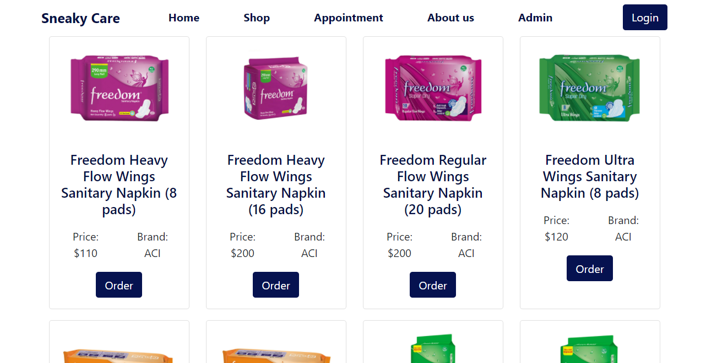

# [Live link](https://sneaky-care.web.app/), [Server Link](https://github.com/AbulBashar38/sneaky-care-server)

#### This website is basically made for rural woman. Village girls and woman can't buy sanitary napkin or pad easily. So the can buy pad and take appointment from great gynecologist of bangladesh. In the home page you can see main home banner,motive section,services,brands section, doctors,testimonial,contact,footer.

# Features
* Form services option you can take apppointment and can buy sanitary napkin and you can also get offers but offer is currently unavailable.
* if you click buy btn of any product in shop then you can see checkout page and confirem your order.
* You can't go any pages without authenticate so you have to authenticate with google
* In the admin panel for general users the can get access of **Dashboard**, **Shop**, **Appointment**, and **Review**
* But if you are an **Admin** then you can see all Option.
* An admin can remove somthig,can add add something like services, product, offer, and can update the current state of order.
* Its an full responsive website
  
## Home page
#### You can Easily go to the shop page and also Appointment page.

## Shop page
#### You can get all products and can buy.

## Admin Page
#### if you are a normal user than you can see the 4 option in the side bar but if you are admin then you can see all option.

